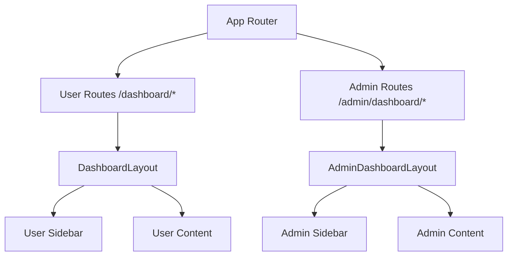

# 🍽️ Mathe's Eatery - Restaurant Management Dashboard

 This project features separate dashboards for users and administrators with modern UI/UX design principles.

## 📋 Table of Contents

- [🏗️ Project Structure](#️-project-structure)
- [🎨 Dashboard Architecture](#-dashboard-architecture)
- [👤 User Dashboard](#-user-dashboard)
- [👨‍💼 Admin Dashboard](#-admin-dashboard)
- [🔧 Technical Implementation](#-technical-implementation)
- [🚀 Getting Started](#-getting-started)
- [📱 Features](#-features)

## 🏗️ Project Structure

```
src/
├── components/              # Reusable UI components
│   ├── Footer.tsx
│   ├── Navbar.tsx
│   └── home/               # Home page components
├── dashboardDesign/        # Dashboard-specific layouts
│   ├── DashboardLayout.tsx     # User dashboard layout
│   ├── AdminDashboardLayout.tsx # Admin dashboard layout
│   ├── Sidebar.tsx            # User sidebar navigation
│   └── AdminSidebar.tsx       # Admin sidebar navigation
├── pages/                  # Page components
│   ├── userPages/          # User dashboard pages
│   │   ├── UserDashboard.tsx
│   │   ├── Orders.tsx
│   │   └── UserProfile.tsx
│   ├── admin/              # Admin dashboard pages
│   │   ├── AdminDashboard.tsx
│   │   ├── AllOrders.tsx
│   │   ├── AllMenuItems.tsx
│   │   └── AllCustomers.tsx
│   └── [other pages...]
├── features/               # Redux slices and API
├── store/                  # Redux store configuration
└── types/                  # TypeScript type definitions
```

## 🎨 Dashboard Architecture

Our dashboard system is built with a **modular, scalable architecture** that separates user and admin functionalities while maintaining consistent design patterns.

### Design Principles

1. **🔄 Separation of Concerns**: Distinct layouts for users and admins
2. **📱 Responsive Design**: Mobile-first approach with TailwindCSS
3. **🎯 User-Centric**: Context-aware navigation and content
4. **♿ Accessibility**: Proper semantic HTML and ARIA attributes
5. **⚡ Performance**: Optimized components and lazy loading

### Layout Architecture



## 👤 User Dashboard

### 🎯 Purpose

Designed for **restaurant customers** to manage their dining experience, track orders, and access personalized features.

### 🏗️ Architecture

#### **Layout Structure**

- **Header**: Top navigation with authentication status
- **Sidebar**: User-specific navigation menu
- **Main Content**: Dynamic content area
- **Footer**: Site information and links

#### **Key Components**

**`DashboardLayout.tsx`**

```typescript
interface DashboardLayoutProps {
    children: React.ReactNode
}

const DashboardLayout: React.FC<DashboardLayoutProps> = ({ children }) => {
    return (
        <div className="min-h-screen bg-gray-50">
            <Navbar />
            <div className="flex">
                <Sidebar />
                <main className="flex-1 ml-64">{children}</main>
            </div>
            <Footer />
        </div>
    )
}
```

**`Sidebar.tsx`** - User Navigation

```typescript
const navigationItems = [
    {
        name: 'My Dashboard',
        path: '/dashboard',
        icon: <DashboardIcon />
    },
    {
        name: 'My Orders', 
        path: '/dashboard/my-orders',
        icon: <OrderIcon />
    },
    {
        name: 'My Profile',
        path: '/dashboard/user-profile', 
        icon: <ProfileIcon />
    }
]
```

### 📊 User Dashboard Features

#### **Welcome Section**

- **Personalized Greeting**: Dynamic user name with friendly message
- **Gradient Header**: Eye-catching design with restaurant branding
- **User Context**: Displays user-specific welcome message

#### **Statistics Cards**

- **My Orders**: Personal order count with monthly growth
- **Total Spent**: Yearly spending with visual indicators
- **Loyalty Points**: Gamification with point tracking
- **Favorite Items**: Saved preferences count

#### **Recent Orders**

```typescript
interface RecentOrder {
    id: number
    restaurant: string
    items: string
    amount: number
    status: 'Delivered' | 'In Transit' | 'Preparing'
    date: string
    rating: number
}
```

Features:

- **Order History**: Recent orders with detailed information
- **Status Tracking**: Real-time order status updates
- **Rating System**: 5-star rating for completed orders
- **Reorder Functionality**: Quick reorder from favorites

#### **Quick Actions**

- **Order Now**: Direct access to menu
- **View Favorites**: Access saved items
- **Loyalty Rewards**: Check rewards status
- **Profile Settings**: Account management

#### **Favorite Items Grid**

- **Visual Display**: Food emojis and item images
- **Quick Reorder**: One-click reorder functionality
- **Order History**: Shows how many times ordered
- **Pricing**: Clear price display

## 👨‍💼 Admin Dashboard

### 🎯 Purpose

Designed for **restaurant staff and managers** to oversee operations, manage orders, and analyze business metrics.

### 🏗️ Architecture

#### **Layout Structure**

- **Header**: Administrative navigation and user controls
- **Admin Sidebar**: Management-focused navigation
- **Main Content**: Comprehensive admin tools
- **Footer**: Administrative links and information

#### **Key Components**

**`AdminDashboardLayout.tsx`**

```typescript
const AdminDashboardLayout: React.FC<DashboardLayoutProps> = ({ children }) => {
    return (
        <div className="min-h-screen bg-gray-50">
            <Navbar />
            <div className="flex">
                <AdminSidebar />
                <main className="flex-1 ml-64">{children}</main>
            </div>
            <Footer />
        </div>
    )
}
```

**`AdminSidebar.tsx`** - Admin Navigation

```typescript
const navigationItems = [
    {
        name: 'Analytics',
        path: '/admin/dashboard',
        icon: <AnalyticsIcon />
    },
    {
        name: 'All Orders',
        path: '/admin/dashboard/all-orders', 
        icon: <OrdersIcon />
    },
    {
        name: 'Menu Items',
        path: '/admin/dashboard/all-menu-items',
        icon: <MenuIcon />
    },
    {
        name: 'All Customers',
        path: '/admin/dashboard/all-customers',
        icon: <CustomersIcon />
    }
]
```

### 📈 Admin Dashboard Features

#### **Analytics Overview**

- **Revenue Metrics**: Total revenue with trend analysis
- **Order Statistics**: Complete order tracking and analytics
- **Customer Insights**: User engagement and loyalty metrics
- **Menu Performance**: Item popularity and sales data

#### **Business Intelligence Cards**

- **Total Orders**: System-wide order tracking
- **Revenue Analytics**: Financial performance metrics
- **Customer Management**: User base analytics
- **Inventory Tracking**: Menu item availability

#### **Order Management**

- **Real-time Updates**: Live order status tracking
- **Bulk Operations**: Batch order processing
- **Status Management**: Order workflow control
- **Customer Communication**: Direct order updates

#### **Quick Actions**

- **Add Menu Item**: New item creation
- **New Order**: Manual order entry
- **View Reports**: Detailed analytics access
- **System Settings**: Administrative controls

## 🔧 Technical Implementation

### **State Management**

- **Redux Toolkit**: Centralized state management
- **Auth Slice**: User authentication state
- **Type Safety**: Full TypeScript integration

### **Routing Architecture**

```typescript
const router = createBrowserRouter([
    // User Dashboard Routes
    {
        path: '/dashboard',
        element: <UserDashboard />
    },
    {
        path: '/dashboard/my-orders', 
        element: <Orders />
    },
    {
        path: '/dashboard/user-profile',
        element: <UserProfile />
    },
  
    // Admin Dashboard Routes
    {
        path: '/admin/dashboard',
        element: <AdminDashboard />
    },
    {
        path: '/admin/dashboard/all-orders',
        element: <AllOrders />
    },
    // ... more admin routes
])
```

### **Active State Management**

```typescript
const isActive = (path: string) => location.pathname === path

// Dynamic styling based on current route
className={`sidebar-link ${
    isActive(item.path)
        ? 'bg-green-800 text-white shadow-md'
        : 'text-gray-600 hover:bg-gray-100'
}`}
```

### **Component Architecture**

#### **Layout Components**

- **Shared Navbar**: Authentication-aware navigation
- **Role-based Sidebars**: Context-specific navigation menus
- **Responsive Design**: Mobile-first responsive layouts

#### **Data Flow**

1. **Redux Store**: Centralized application state
2. **API Integration**: RESTful API communication
3. **Type Safety**: TypeScript interfaces for all data
4. **Error Handling**: Comprehensive error boundaries

### **Styling Architecture**

#### **Design System**

- **Color Palette**: Consistent green theme (#065f46, #10b981)
- **Typography**: Systematic font scales and weights
- **Spacing**: Consistent padding and margin scales
- **Shadows**: Layered shadow system for depth

#### **CSS Framework**

- **TailwindCSS**: Utility-first CSS framework
- **DaisyUI**: Pre-built component library
- **Custom Components**: Restaurant-specific styling

#### **Responsive Design**

```css
/* Mobile-first responsive breakpoints */
sm: '640px'   /* Small devices */
md: '768px'   /* Tablets */
lg: '1024px'  /* Laptops */
xl: '1280px'  /* Desktops */
```

## 🚀 Getting Started

### Prerequisites

- **Node.js** 18+
- **pnpm** (recommended) or npm/yarn

### Installation

```bash
# Clone the repository
git clone [repository-url]

# Navigate to project directory
cd restaurant-management-dashboard

# Install dependencies
pnpm install

# Start development server
pnpm dev
```

## 📱 Features

### 🔐 Authentication

- **User Registration/Login**: Secure authentication system
- **Role-based Access**: User and admin role separation
- **Session Management**: Persistent login state

### 👤 User Features

- **Personal Dashboard**: Customized user experience
- **Order Tracking**: Real-time order status updates
- **Loyalty Program**: Points tracking and rewards
- **Favorite Items**: Save and reorder preferred meals
- **Rating System**: Review completed orders

### 👨‍💼 Admin Features

- **Business Analytics**: Comprehensive reporting dashboard
- **Order Management**: Complete order lifecycle control
- **Menu Management**: Add, edit, and manage menu items
- **Customer Management**: User account administration
- **Revenue Tracking**: Financial analytics and reporting

### Build & Deployment

```bash
# Build for production
pnpm build

# Preview production build
pnpm preview

# Analyze bundle size
pnpm analyze
```

---

## 📄 License

This project is licensed under the MIT License - see the [LICENSE](LICENSE) file for details.

## 🤝 Contributing

1. Fork the repository
2. Create a feature branch
3. Commit your changes
4. Push to the branch
5. Open a Pull Request
